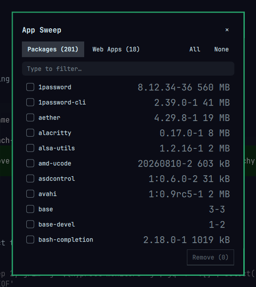

# App Sweep

Bulk-remove packages and web apps on [Omarchy](https://omarchy.org/) from a
floating checkbox list — instead of removing them one at a time.



## What it does

- **Packages tab** — every explicitly installed package (`pacman -Qqe`) with
  version and installed size (via `expac` when available). Check any number of
  them and remove them in one `pacman -Rns` transaction, authenticated through
  polkit.
- **Web Apps tab** — every launcher created by `omarchy webapp install`.
  Checked launchers are removed with the stock `omarchy-webapp-remove`.
- Type to filter, click rows to toggle, `All`/`None` for the visible rows,
  and a confirmation step before anything is touched.

## Install

```bash
omarchy plugin add https://github.com/antoniowav/omarchy-appsweep --enable
```

To remove the plugin:

```bash
omarchy plugin remove io.github.antoniowav.appsweep
```

Removing the plugin never touches your packages or web apps — it only
removes the panel itself.

App Sweep is a panel plugin: it adds no bar widget. Summon it however you like:

```bash
# Toggle the panel
omarchy-shell shell toggle io.github.antoniowav.appsweep '{}'

# Open straight on the Web Apps tab
omarchy-shell shell toggle io.github.antoniowav.appsweep '{"tab":"webapps"}'
```

### Omarchy menu entry

Add it under the existing **Remove** submenu in
`~/.config/omarchy/extensions/omarchy-menu.jsonc`:

```jsonc
"remove.bulk": {
  "icon": "󰆴",
  "label": "Bulk…",
  "description": "Checkbox list for removing several packages or web apps at once",
  "action": "omarchy-shell shell toggle io.github.antoniowav.appsweep '{}'"
}
```

### Keybind

In `~/.config/hypr/bindings.lua`:

```lua
o.bind("SUPER SHIFT", "BACKSPACE", "App Sweep", "omarchy-shell shell toggle io.github.antoniowav.appsweep '{}'")
```

## Keys

| Key | Action |
|-----|--------|
| type | filter the list |
| `Esc` | clear filter → close |
| `Enter` | remove selected (asks to confirm) |
| click outside | close |

## Safety notes

- Package removal runs `pacman -Rns --noconfirm` **after** an explicit
  in-panel confirmation. `-Rns` also removes now-unneeded dependencies and
  their config files — the same behaviour as the stock `omarchy pkg remove`.
- If pacman refuses (something still depends on a checked package), nothing
  is removed and the error is shown in the panel.
- The plugin itself never elevates: polkit (`pkexec`) prompts for
  authentication on every package removal.

## Dependencies

Everything App Sweep uses ships with a stock Omarchy install:

- `pacman` and `polkit` (`pkexec`) for package removal
- `expac` for installed sizes and versions — optional; without it the
  packages tab falls back to `pacman -Qe` and omits sizes
- `omarchy-webapp-remove` for web app launchers

No network access, no API keys, no configuration files are written.

## License

MIT
